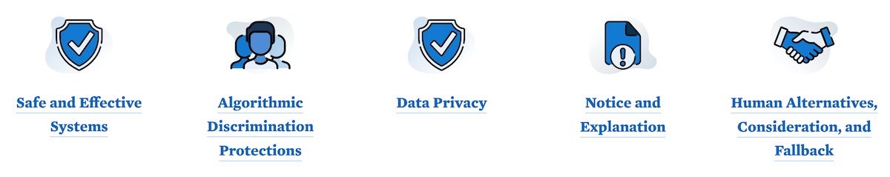
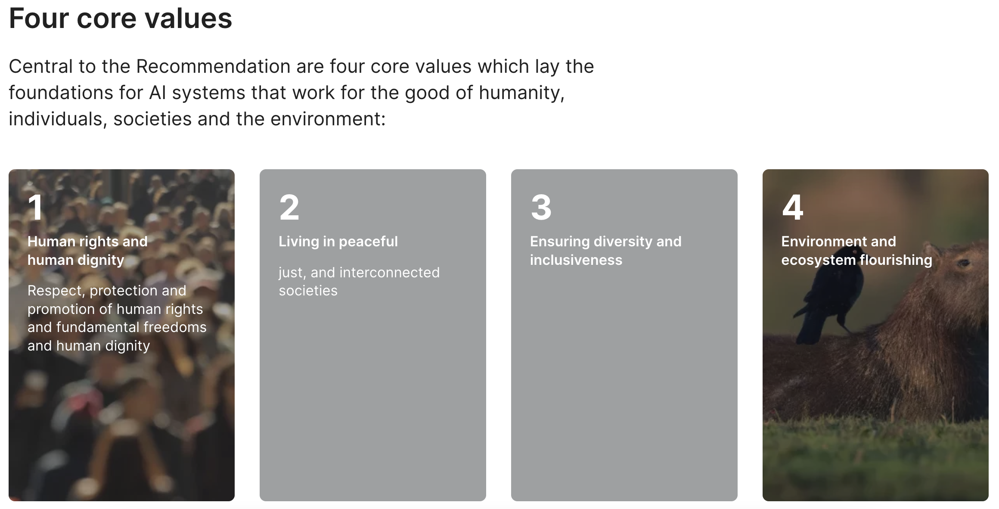
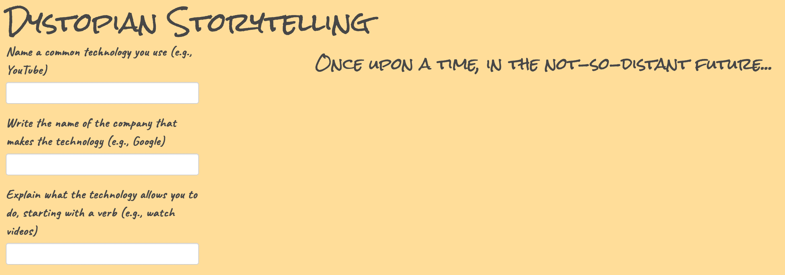

```{r setup, include=FALSE}
usethis::use_git_ignore(c("*.csv", "*.rds"))
options(htmltools.dir.version = FALSE)

library(knitr)
library(tidyverse)
library(xaringan)
library(fontawesome)
```

class: inverse, center, middle

# `r fa("far fa-images", fill = "#fff")`

**View the slides:** 

[bretsw.com/eme6356-su24-module6](https://bretsw.com/eme6356-su24-module6)

---

class: inverse, center, middle

# `r fa("fas fa-comments", fill = "#fff")` <br><br> Looking Back at Module 5

---

# `r fa("fas fa-comments", fill = "#fff")` Resources for Module 5

```{r, out.width = "50%", fig.show = "hold", echo = FALSE}
include_graphics(c("img/5-r-dataisbeautiful.jpg", "img/5-our-world-in-data.png"))
```

- [**r/dataisbeautiful**](https://www.reddit.com/r/dataisbeautiful/)

- [**Our World in Data**](https://ourworldindata.org/)

---

class: inverse, center, middle

# `r fa("fas fa-question", fill = "#fff")` <br><br> Module 5 <br> Final Thoughts?

---

class: inverse, center, middle

# `r fa("fas fa-triangle-exclamation", fill = "#fff")` <br><br> Module 6: <br> Ethics in Analytics

---

# `r fa("fas fa-triangle-exclamation", fill = "#fff")` Is This Technology Ethical?

```{r, out.width = "100%", echo = FALSE, fig.align = "center"}
include_graphics("img/6-technology-ethical.png")
```

<div class="caption">
<a href="https://technoethics.digciz.org/index.php/is-technology-ethical-analysis-helper/">Is This Technology Ethical? Analysis Helper for Educators</a>
</div>

Resource from [Autumm Caines](http://autummcaines.com/)

---

# `r fa("fas fa-triangle-exclamation", fill = "#fff")` CompelU

```{r, out.width = "100%", echo = FALSE, fig.align = "center"}
include_graphics("img/6-compelu.png")
```

<div class="caption">
<a href="https://compelu.com/">CompelU: We Watch We Care</a>
</div>

Resource from [Autumm Caines](http://autummcaines.com/)

---

# `r fa("fas fa-triangle-exclamation", fill = "#fff")` Civics of Technology

```{r, out.width = "100%", echo = FALSE, fig.align = "center"}
include_graphics("img/6-civics-of-technology.png")
```

<div class="caption">
<a href="https://www.civicsoftechnology.org/">Civics of Technology website</a>
</div>

Resource from [Dan Krutka](https://coe.unt.edu/people/daniel-g-krutka) and [Marie Heath](https://www.loyola.edu/school-education/faculty/marie-heath)

---

# `r fa("fas fa-triangle-exclamation", fill = "#fff")` AI Bill of Rights

```{r, out.width = "100%", echo = FALSE, fig.align = "center"}

```

<div class="caption">
<a href="https://www.whitehouse.gov/ostp/ai-bill-of-rights/">Blueprint for an AI Bill of Rights</a>
</div>

Resource from [U.S. White House Office of Science & Technology Policy](https://www.whitehouse.gov/ostp/)

---

# `r fa("fas fa-triangle-exclamation", fill = "#fff")` Ethics of AI

```{r, out.width = "100%", echo = FALSE, fig.align = "center"}

```

<div class="caption">
<a href="https://www.unesco.org/en/artificial-intelligence/recommendation-ethics">UNESCO Ethics of Artificial Intelligence</a>
</div>

Resource from the United Nations Educational, Scientific and Cultural Organization [(UNESCO)](https://www.unesco.org/en)

---

# `r fa("fas fa-triangle-exclamation", fill = "#fff")` Recommendations on AI

```{r, out.width = "300px", echo = FALSE, fig.align = "center"}

```

<div class="caption">
<a href="https://unesdoc.unesco.org/ark:/48223/pf0000381137">UNESCO Recommendation on the Ethics of Artificial Intelligence</a>
</div>

Resource from the United Nations Educational, Scientific and Cultural Organization [(UNESCO)](https://www.unesco.org/en)

---

class: inverse, center, middle

# `r fa("fas fa-pencil", fill = "#fff")` <br><br> MadLibs

---

# `r fa("fas fa-pencil", fill = "#fff")` Black Mirror MadLibs

```{r, out.width = "100%", echo = FALSE, fig.align = "center"}
include_graphics("img/6-madlibs1.png")
```

<div class="caption">
<a href="https://bretsw.shinyapps.io/madlibs-play/">MadLibs Play</a>
</div>

---
# `r fa("fas fa-pencil", fill = "#fff")` Black Mirror MadLibs

```{r, out.width = "100%", echo = FALSE, fig.align = "center"}

```

<div class="caption">
<a href="https://bretsw.shinyapps.io/data-dystopia/">Dystopian Storytelling</a>
</div>

---

class: inverse, center, middle

# `r fa("fas fa-binoculars", fill = "#fff")` <br><br> Looking ahead

---

# `r fa("fas fa-calendar-day", fill = "#fff")` Semester schedule

```{r, out.width = "720px", echo = FALSE, fig.align = "center"}
include_graphics("img/across-time.jpg")
```

- **Module 1:** Introduction to Analytics
- **Module 2:** Performance Analytics
- **Module 3:** Learning Analytics
- **Module 4:** Web Analytics
- **Module 5:** Data Visualization
- **Module 6: Ethics in Learning Analytics**
- **Module 7:** Future of Analytics
- **Module 8:** Case Discussions
---

# `r fa("fas fa-calendar-day", fill = "#fff")` Major Assignments

```{r, out.width = "560px", echo = FALSE, fig.align = "center"}
include_graphics("img/build.jpg")
```

### Analytics Assignments (60%)

- Analytics Problem Plan (100 points)
- Analytics Practice (200 points)
- **Analytics Case Presentation (200 points; group project)**
- Analytics Ethics Statement (100 points)

---

# `r fa("fas fa-calendar-day", fill = "#fff")` Major Assignments

```{r, out.width = "300px", echo = FALSE, fig.align = "center"}
include_graphics("img/build.jpg")
```

### Analytics Case Presentation (200 pts) - **due end of Module 7**

--

- Get together with your usual project team

--

- Select a case study topic (could be connected to your semester-long topic):
  - Research case study
  - Tool case study
  - Real-world setting case study

--

- Explore your case topic

--

- Create a slide deck to present your case and serve as a prompt for Module 8 Discussion


---

class: inverse, center, middle

# `r fa("fas fa-question", fill = "#fff")` <br><br> Questions

<hr>

**What questions can I answer for you now?**

**How can I support you this week?**

<hr>

`r fa("envelope", fill = "#fff")` [bret.staudtwillet@fsu.edu](mailto:bret.staudtwillet@fsu.edu) | `r fa("globe", fill = "#fff")` [bretsw.com](https://bretsw.com) | `r fa("fab fa-github", fill = "#fff")` [GitHub](https://github.com/bretsw/)

---

class: inverse, center, middle

# Learn to Code

```{r, out.width = "320px", echo = FALSE, fig.align = "center"}
include_graphics("img/dsieur.jpg")
```

**https://datascienceineducation.com/**

---

class: inverse, center, middle

# `r fa("fas fa-otter", fill = "#fff")` <br><br> Play in the <br> [Analytics Sandbox](https://bretsw.com/sandbox)

`r fa("fab fa-github", fill = "#fff")` [GitHub repository for code and data](https://github.com/bretsw/sandbox)

`r fa("fas fa-cubes-stacked", fill = "#fff")` [Datasets for practice](https://bretsw.com/post/datasets/)
